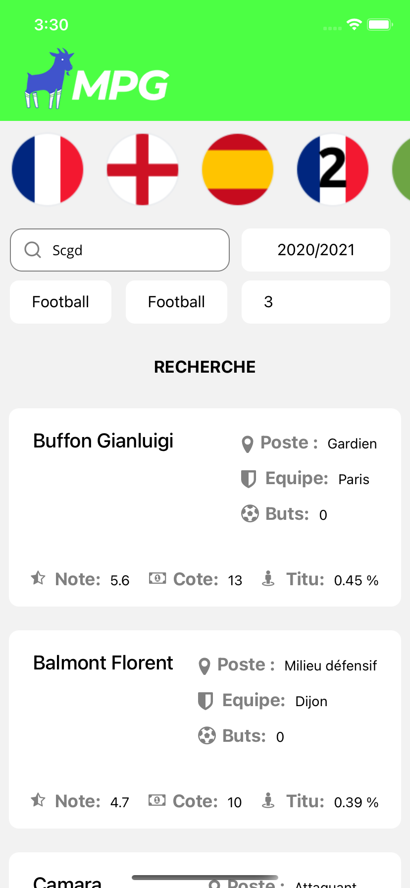
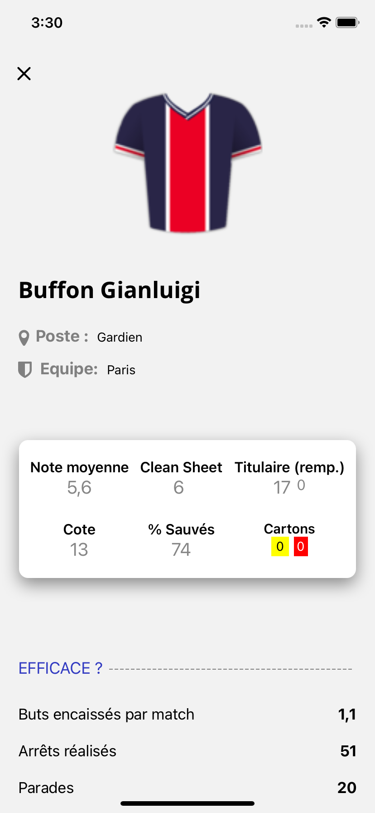
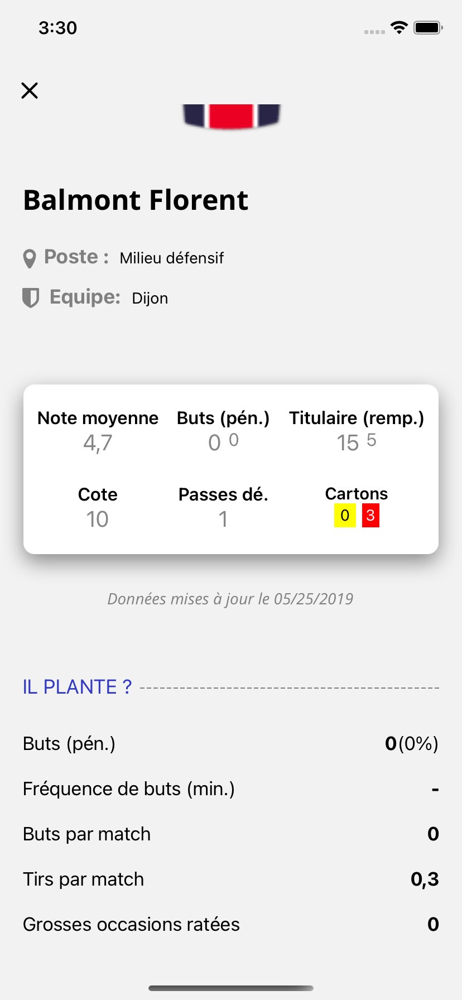

# Test_technique_MPG
Bienvenue sur mon test technique

## lancer le projet 
Il faut d'abord effectuer la commande suivante
- `npm install --save` (Pour installer tout les modules qui ont été enlevés `a cause de github`)

puis la commande 
`react-native run-ios` ou `react-native run-android`

Pour tout problèmes sur le projet veuillez me contacter.
Alexdieudonne02@gmail.com
